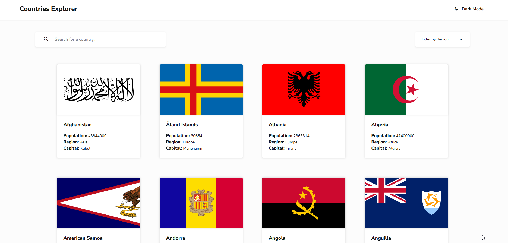

# Countries Explorer

A responsive web app to explore information about 250+ countries, built with vanilla JavaScript and the REST Countries API.

## Demo

[Live Demo](https://twx0504.github.io/countries-explorer/)

## Features

- Search countries by name
- Filter countries by region (All, Africa, Americas, Asia, Europe, Oceania)
- View detailed country info
- Navigate to bordering countries directly from the detail view
- Dark/light theme toggle
- localStorage caching
- Keyboard accessible
- Fully responsive across mobile, tablet, and desktop

## Tech Stack

- **JavaScript**
- **HTML5**
- **CSS3** 
- **[REST Countries API](https://restcountries.com)**

## Architecture

The project follows MVC philosophy.

1. `data.js` handles data fetching and data processing.
2. `view.js` handles page rendering
3. `main.js` handles events
4. `utils/` stores helper functions like debounce, filter, request, storage, etc.

## Lessons Learned

I had learned about MVC architecture from some tutorials, but this was my first time using the concept I learned in a real project. It turned out to be much harder than I expected.

I also learned to work with real API for the very first time. However, I realized that the data fetched from the API is not always in the shape I need. I spent time thinking about what fields I need, and processed the raw data before using them to render the UI.

I also explored accessibility by writing semantic HTML and using ARIA attributes. Besides, I also considered keyboard users and added keyboard navigation.

Finally, I learned to make the webapp responsive across different screen sizes - mobile, tablets, and desktop to improve user experience.